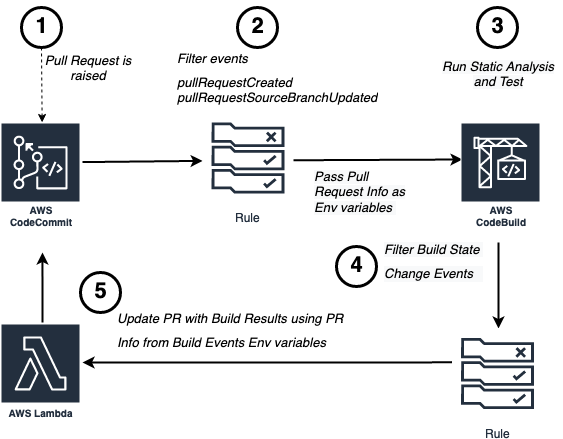

# AWS CDK for Building Pull Request Hook on AWS CodeCommit
### Table of contents
1. [Introduction](#introduction)
2. [Architecture](#architecture)
3. [Project structure](#project-structure)
4. [Prerequisites](#prerequisites)
5. [Tools and services](#tools-and-services)
6. [Usage](#usage)
7. [Clean up](#clean-up)
8. [Reference](#reference)
9. [Contributing](#security)
10. [License](#license)

## Introduction
This project provides an example of building Pull Request Hook on AWS CodeCommit. This project builds the necessary infrastructure to integrate automatic trigger of AWS CodeBuild when Pull Request request are raised in AWS CodeCommit and then links build results to Pull Request.

Project consists of three main parts:
* AWS infrastructure and deployment definition - [AWS CDK](https://aws.amazon.com/cdk/) scripts written in Python
* [AWS Lambda](https://aws.amazon.com/lambda/) function - triggered on Build state change and updates result in Pull Request.
* [AWS CodeBuild](https://aws.amazon.com/codebuild/) builspecs - contains the sample build specs to run pylint and pytest as part of build process.

## Architecture


[AWS CodeCommit](https://aws.amazon.com/codecommit/) Pull Request generates [AWS EventBridge Events](https://docs.aws.amazon.com/eventbridge/latest/userguide/eb-events.html), we are intrested in only events which results in Pull Request creation or modification. This json event has all the information relevent to Pull Request which are required by the AWS Lambda function to add automated comments in Pull Request. The main tweak is to pass these paramater to [AWS Lambda](https://aws.amazon.com/lambda/) which is done via [environmentVariablesOverride](https://docs.aws.amazon.com/codebuild/latest/APIReference/API_StartBuild.html#CodeBuild-StartBuild-request-environmentVariablesOverride) feature of [AWS CodeBuild](https://aws.amazon.com/codebuild/).

## Project structure
* [`cicd_pr_stack`](cicd_pr_stack.py) - conatins the requried [AWS CDK stacks](https://docs.aws.amazon.com/cdk/latest/guide/stacks.html)
* [`lambda_publish_build_result/handler.py`](lambda_publish_build_result/handler.py) - contains [AWS Lambda](https://aws.amazon.com/lambda/) function that is triggered on build state change and publishes comments on Pull request.
* [`buildspec-tests.yaml`](buildspec-tests.yaml) sample buildspecs which is used by [AWS CodeBuild](https://aws.amazon.com/codebuild/) to run plylint and pytest. Copy this file and submit to [AWS CodeCommit](https://aws.amazon.com/codecommit/) repositories so that [AWS CodeBuild](https://aws.amazon.com/codebuild/) can find it in source, modify this as per your desired commands.
* [`doc`](doc) - directory containing architecture diagrams
* [`requirements.txt`](requirements.txt) - contains the python dependacies.

## Prerequisites
* [AWS Cloud Development Kit (AWS CDK)](https://docs.aws.amazon.com/cdk/latest/guide/getting_started.html), installed
* [AWS Command Line Interface (AWS CLI)](https://docs.aws.amazon.com/cli/latest/userguide/install-cliv2.html) version 2, installed
* [Python 3](https://www.python.org/downloads/), installed

## Tools and services
* [AWS CDK](https://aws.amazon.com/cdk/) – The AWS Cloud Development Kit (AWS CDK) is a software development framework for defining your cloud infrastructure and resources by using programming languages such as TypeScript, JavaScript, Python, Java, and C#/.Net.
* [AWS Lambda](https://aws.amazon.com/lambda/) -  AWS Lambda is a serverless compute service that lets you run code without provisioning or managing servers, creating workload-aware cluster scaling logic, maintaining event integrations, or managing runtimes.
* [AWS CodeBuild](https://aws.amazon.com/codebuild/) - AWS CodeBuild is a fully managed continuous integration service that compiles source code, runs tests, and produces software packages that are ready to deploy.
* [AWS CodeCommit](https://aws.amazon.com/codecommit/) - AWS CodeCommit is a secure, highly scalable, managed source control service that hosts private Git repositories.

* [AWS EventBridge Events](https://docs.aws.amazon.com/eventbridge/latest/userguide/eb-events.html) - Amazon EventBridge is a serverless event bus service that you can use to connect your applications with data from a variety of sources

## Usage 
set the region where your codecommit repo exist.
e.g
```
export AWS_DEFAULT_REGION=eu-central-1
```

then follow instructions on [Running CDK Python Examples](https://github.com/aws-samples/aws-cdk-examples/tree/master/python#running-examples)

## Clean up
Follow [AWS CDK instructions](https://docs.aws.amazon.com/cdk/latest/guide/hello_world.html#hello_world_tutorial_destroy) to remove AWS CDK stacks from your account.

## Reference
inspired by [AWS DevOps Blog](https://aws.amazon.com/blogs/devops/validating-aws-codecommit-pull-requests-with-aws-codebuild-and-aws-lambda/)

## Security

See [CONTRIBUTING](CONTRIBUTING.md#security-issue-notifications) for more information.

## License

This library is licensed under the MIT-0 License. See the LICENSE file.